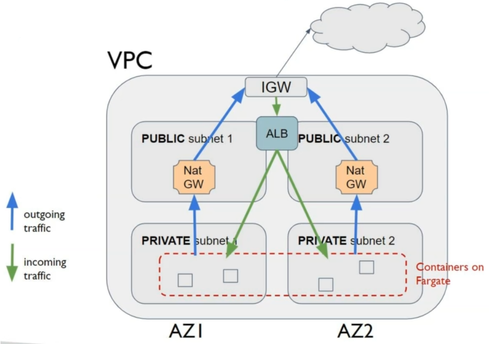

# AWS ECS & Fargate

### Intro

The repo consists of the following:
- ECS Cluster setup.
- Task definitions, Task placement, Networking modes, environment variables.
- Service load-balancing, auto-scaling, cluster capacity providers & presistent stoage with EFS.
- Amazon ECR, CI/CD pipeline(Code Commit, Code Build, Code Pipeline & Code Deploy[Blue/Green]), integration with a private docker repo.
- Microservices such as Cloud Map, X-Ray & App Mesh.

---

### What is ECS?

- ECS stands for Elastic Container Service.
- It is used to launch docker containers on AWS. AWS takes care of handling the start/stop of these containers. And it is our responsibility to provision & maintain the infrastructure - which are the EC2 instances that run the ECS agent which in turn runs the docker containers.
- ECS service decides which EC2 instance must be responsible for running the docker containers and register them with the application load balancer.

### What is Fargate?

- Fargate is also used to launch Docker containers on AWS but is a serverless offering.
- Which means, we don't provision & maintain the underlying EC2 infrastructure.
- AWS runs the containers based on the CPU-RAM configurations.

### What is ECS Cluster?

- ECS cluster are a logical group of EC2 instances. These EC2 instances run the ECS agent. The ECS agent will register the EC2 instance to the ECS cluster. The EC2 instances will run a speial AMI that is made for ECS. 

---

### Creating a Container on ECS-Fargate

1. Go to AWS console and search for ECS.
2. Click on "Get Started".
3. ECS objects have 4 components:
- Container Definition: 
    - An image for the container to run.
    - Select 'nginx' container definition.
- Task Definition: 
    - A set of attributes that serves as the configurations for the tasks such as Memory, vCPU, Execution Role, Definition name, etc.
    - Provide the task a name, *awspc* as network mode, a new task execution role, compatibilities as *FARGATE* with task memory=0.5GB and CPU=0.25vCPU.
- Service: 
    - The number of instances of the task to be run simultaenously in an ECS cluster.
    - Provide a name to the service, set the number of tasks as 1, security group to *Automatically create new* and no load balancers.
- Cluster: 
    - Configuration to set a cluster name, the VPC and subnets.
    - Set a cluster name, and leave VPC ID as well as Subnets to be automatically created.
4. Press 'Create'.
5. To test if it is working navigate to Clusters > <cluster_name> > <task> > Copy paste the *Public IP* into a browser and it should display the NGINX page.

### Deleting the ECS Cluster

1. Go to Clusters.
2. Select the Service and under actions hit delete.

---

### Pricing

ECS pricing can be based on the type of model we choose:
1) EC2 Model
    - Pricing costs from EC2, EBS, Load balancers, EFS.
    - No extra cost for ECS.
2) Fargate Model
    - Pricing is based on the amount of vCPU and RAM.

---

### Architectures

- Public Subnet
    - Run ECS service in multiple availablity zones and one public subnet in each of them. All of them come under a single VPC.
    - Simple
    - Free tier eligible
- Private/Public Subnet
    - Run the ECS service in multiple availablity zones with a private and public subnet in each of them. All of them come under a single VPC.
    - Requires NAT gateways and APB to provide access to users to the private subnet.
    - The setup costs a lot of money hourly.

---

### ECS Cluster Setup

##### Summary

The ECS cluster setup can be done as follows: Have the ECS agent run in the EC2 instance, which will register the instance with the ECS service, that can send cloudwatch logs and retrieve images from the ECR.
The ECS tasks will have task roles and each of these tasks will have IAM roles depending upon the services required.

##### IAM Roles

- EC2 Role : ECS agent on EC2 to communicate with ECS and ECR.
- ECS Role : Authorizes ECS to manage resources.
- ECS Task Execution Role : Role required for ECS tasks along with the premissions for the service on which the task acts upon.
- Autocaling Role : Allows AWS autoscaling to inspect stats and adjust scaleable targets.

Code: [iam_roles.yml]()

##### Core Infrastructure

The core infrastructure consists of:
- VPC
- 2 Subnets for 2 AZ's
- Internet Gateway

Code: [core_infrastructure.yml]()

Use the AWS CLI with the following command to deploy the above stack to AWS:
```bash
aws cloudformation create-stack --capabilities CAPABILITY_IAM --stack-name ecs-core-infrastructure --template-body file://./core_infrastructure.yml
```

##### Cluster Creation

**EC2 Model:**
- In the management console, select ECS.
- Click 'Create Cluster' > 'EC2 + Networking(Linux)' cluster template
- Under configuration:
    - Provide the name: `ecs-ec2`
    - Select instance type as: `t2.small`
    - Choose the key pair.
    - Choose the VPC created under Networking > 'VPC'
    - Choose both the Subnets created under Networking > 'Subnets'
    - Choose the IAM role for ECS instance under 'Container instance IAM' Role.

(OR)

Code: [ecs_ec2.yml]()
Run the above CloudFormation YAML file using the below command:
```bash
aws cloudformation create-stack --stack-name ecs-ec2 --capabilities CAPABILITY_IAM --template-body file://./ecs_ec2.yml
```

**Fargate Model**
- In the management console, select ECS.
- Click 'Create Cluster' > 'Networking only'
- Under configuration:
    - Provide the name: `ecs-fargate`
    - Click 'Create'

(OR)

Code: [ec2_fargate.yml]()
Run the above CloudFomation YAML file using the below command:
```bash
aws cloudformation create-stack --stack-name ecs-fargate --capabilities CAPABILITY_IAM --template-body file://./ecs_fargate.yml
```

**Creation of ECS-Fargate setup using ECS-CLI**

Use the command below to retrieve the vpc and subnet ID\'s from the previously created core infrastructure.
```bash
export CORE_STACK_NAME="ecs-core-infrastructure"
export vpc=$(aws cloudformation describe-stacks --stack-name $CORE_STACK_NAME --query 'Stacks[0].Outputs[?OutputKey==`VpcId`].OutputValue' --output text)
export subnet_1=$(aws cloudformation describe-stacks --stack-name $CORE_STACK_NAME --query 'Stacks[0].Outputs[?OutputKey==`PublicSubnetOne`].OutputValue' --output text)
export subnet_2=$(aws cloudformation describe-stacks --stack-name $CORE_STACK_NAME --query 'Stacks[0].Outputs[?OutputKey==`PublicSubnetTwo`].OutputValue' --output text)

echo "vpc: $vpc"
echo "subnet1: $subnet_1"
echo "subnet2: $subnet_2"
```
These have to be followed by the ECS-CLI command below to use the VPC and subnets to create the ECS cluster of Fargate model.
```bash
ecs-cli up \
--subnets $subnet_1,$subnet_2 \
--vpc $vpc \
--launch-type FARGATE \
--cluster ecs-fargate
```
These have to be followed by the ECS-CLI command below to use the VPC and subnets to create the ECS cluster of EC2 model.
```bash
ecs-cli up --capability-iam \
--subnets $subnet_1,$subnet_2 \
--vpc $vpc \
--launch-type EC2 \
--keypair ecs-key-pair \
--size 1 \
--instance-type t2.small \
--cluster ecs-ec2
```

---

##### Task Definitions

Task definitions are data in JSON format that instructs ECS about running a docker container. The information can be as follows:
- Image name
- Memory & CPU
- Port binding to container and host
- Environment variables
- IAM Role
- Networking information
- Loggin information

**ECS IAM Roles**

- EC2 Instance Profile:
  - Used by the ECS Agent that makes API calls to ECS service
  - Send Cloudwatch logs
  - Pull Docker image from ECR

- ECS Task Role:
  - Allow each task to have specific role
  - Different roles for different ECS services to run

**ECS Service**

Defines how many tasks should be run and how they should be run. They also ensure that the number of tasks desired is running across the fleet of EC2 instances. They are directly liked to load balancers.

Note: Tasks can be run without ECS services.

**Task setup**

FARGATE:

1) In the AWS console for ECS: Choose Task definitions > Create new Task definition > Launch type: FARGATE > Configure task and container definitions as follows:
  - Task definition name: td-simplehttpd
  - Task role: *Select the task execcution IAM role already created*
  - Task size: 0.5GB
  - Task CPU: 0.25vCPU
  - Container Definition:
    - Name: simplehttpd-container
    - Image: gkoenig/simplehttp
    - Memory Limits: Soft Limit - 128
    - Port Mappings: 8000 - TCP
    - Set an enviroment variable where, key="message", value="Hello World"
    - Click "Create"
2) In the AWS console for ECS: Choose Clusters > ecs-ec2 > Tasks Tab > Run new task >
  - Launch type: FARGATE
  - Task definition: td-simplehttpd:2
  - Number of tasks: 1
  - Select the VPC and the 2 subnets created
  - Create a new security groups with a name: simplehttpd-access
  - Expose port 8000 by selecting custom TCP
  - Run Task
In the AWS console for ECS: Choose Clusters > ecs-ec2 > Services Tab > Create >
  - Launch type: FARGATE
  - Service name: simplehttpd-service
  - Number of tasks: 2
  - Deployment type: Rolling update
  - Click "Next Step"
  - Select the VPC and both the subnets
  - Select the previously created security group
  - Click "Next Step"


EC2:

1) On the AWS console for ECS select task definitions > Create new task definition > EC2 launch type > Configure task and container definitions as follows:
  - Name: td-simplehttpd-ec2
  - Task Role: *Select the task execcution IAM role already created*
  - Network mode: default
  - Container Definition:
    - Name: simplehttpd-container
    - Image: gkoenig/simplehttp:latest
    - Memory Limits: Soft Limit - 128
    - Port Mappings: Host Port: 0, Container Port: 8000 - TCP
    - Set an enviroment variable where, key="message", value="Hello World"
    - Click "Create"
2) On the AWS console for ECS select Clusters > ecs-ec2 > Tasks Tab > Run new task >
  - Launch types: EC2
  - Definition: td-simplehttpd-ec2:7
  - Cluster: ecs-ec2
  - Number of tasks: 2
  - Task placement: AZ Balanced Spread
  - Click "Run task"
  - Click the security group attached to this task > Inbound rules > Add rule > SSH > Port 22 > Save rules
In the AWS console for ECS: Choose Clusters > ecs-ec2 > Services Tab > Create >
  - Launch type: EC2
  - Task Definition: td-simplehttpd-ec2:7
  - Service name: simplehttpd-service
  - Number of tasks: 1
  - Deployment type: Rolling update
  - Click "Next Step"

---

##### ECS Tasks Placement

- When an task is launched in EC2 deployment type, ECS has to determine the exectuion of that task among the fleet based on factors such as CPU, memory and ports.
- The following process is used to select container instances when ECS places tasks:
  - Instances that satisfy CPU, memory and port requirements
  - Instances that satisfy task placement constraints
  - Instances that satisfy task placement strategy

The task placement strategies:
- **Binpack**: Place task based on least available amount of CPU memory.
```json
"placementStrategy": [
    {
        "field": "memory",
        "type": "binpack"
    }
]
```
- **Random**: Place task randomly.
```json
"placementStrategy": [
    {
        "type": "random"
    }
]
```
- **Spread**: Place task evenly based on the specified value. Ex: instanceId.
```json
"placementStrategy": [
    {
        "field": "attribute:ecs.availability-zone",
        "type": "spread"
    }
]
```

Note: These strategies can be mixed with each other as well.

ECS Task placement constraints:
- **distinctInstance**: place each task on a different container instance.
```json
"placementConstraints": [
    {
        "type": "distinctInstance"
    }
]
```
- **memberOf**: place task on instances that will satisfy a condition.(Uses Cluster uery Language)
```json
"placementConstraints": [
    {
        "type": "memberOf",
        "expression": "attribute:ecs.instance-type =~ t2.*"
    }
]
```

---

##### ECS Networking Modes

- None: No external connectivity and no port mappings.
- Bridge(default): It spins up a docker virtual network within the EC2 instance and provides a port mapping to the host.
- Host: There is no docker virtual network in the EC2 instance. Also, there is no port mapping. 
- AWS VPC(fargate): Each tasks gets its own unique IP called ENI - Elastic Network Interface with port mapping. This network mode provides the best performance as each tasks gets its own network interface and its own IP without port mapping. The disadvantage is that it is limited by EC2 instances having a max limit on the number of ENI's.

---

##### Sample Real-World Architectures



- IGW - Internet Gateway
- ALB - Application Load Balancer

The setup above can be created via the following steps:
- Use the [setup_infrastructure.yml]() to provide a basic AWS core resources to create an ECS cluster spanning public and private subnets.
- To deploy the above stack use the following aws-cli command:
```bash
aws cloudformation create-stack --stack-name enhanced-architecture --template-body file://./setup_infrastructure.yml
```

---
##### ALB

The Cloudformation template: [alb.yml]() depicts creation of a public facing application load balancer for directly the traffic towards ECS containers. It provides flexibility via the public url towards fargate based web service or ec2 based web service. 

**Advantage**

- Improves security as we don't expose the containers directly to the internet, instead expose the load balancer endpoint(static URL) that can direct traffic to the containers.

**Load Balancing for EC2**

- Bridge networking mode is used to obtain dynamic port mapping.
- The ALB will identify the right port on the EC2 instances.


**Load Balancing for Fargate**

- 'awsvpc' is the networking mode used.
- Each task has an unique IP, each of which will register automatically into an ALB for load-balancing.

---

##### Service Auto-Scaling

- CPU and RAM tracked in CloudWatch at ECS service level
  - Target Tracking: target specific average CloudWatch metric.
  - Step Scaling: scale based on CloudWatch alarms.
  - Scheduled Scaling: based on predictable changes.
- ECS Service Scaling(task level) != EC2 Auto-Scaling(instance level)
- Cluster Capacity Provider 
  - used in association with a cluster to determine the infrastructure that a task runs on.
  - for fargate, FARGATE & FARGATE_SPOT are added automatically.
  - for EC2, an association is required for capacity provider with auto-scaling group.

---

##### ECR

- Elastic Container Registry
- Allows for storing, managing and deploying containers on AWS.
- Pay for what is being used
- Easy integration with ECS
- Support for image vulnerability scanning, versionning, tag, image lifecycle

**Keywords**:
- Registry: 1 registry per account-region combination
- Repository: contains images and resides within a registry
- Images: stored in a repository with a tag
- Authorization: access to repository via policies
- Authentication: retrieve credentials for docker command

**Commands**:
- Retrieve auth token:
```bash
aws ecr get-login-password --region eu-central-1
```

- Login:
```bash
aws ecr get-login-password --region eu-central-1 | docker login \
--username AWS \
--password-stdin \
123456789.dkr.ecr.eu-central-1.amazonaws.com 
```

- Create Repository:
```bash
aws ecr create-repository \
--repository-name testrepo \
--region eu-central-1 \
--image-scanning-configuration scanOnPush=true
```

- Docker push and pull
```bash
docker push 123456789.dkr.ecr.eu-central-1.amazonaws.com/test:latest
docker pull 123456789.dkr.ecr.eu-central-1.amazonaws.com/test:latest
```

- Build Docker image
```bash
docker build -t test
```

- Tag
```bash
docker tag test:latest 123456789.dkr.ecr.eu-central-1.amazonaws.com/test:latest
```

---

##### CI-CD on ECS

**Continuous Integration**

As code is rapidly pushed into a central repository on an incremental basis, it is essential that a build or test server checks the code that is being pushed. Some example of such a server are CodeBuild, Jenkins CI, etc. If the build fails, the developer can fix the issue and re-submit the code. CI holds an advantage in identifying bugs early and fixing them.

**Continous Delivery**

As software gets multiple changes such as bug fixes or additional features, there has to be an automation setup to deploy this reliably. Some examples of tools that automate such deployments are Jenkins CD, CodeDeploy, etc

**Tech Stack of achieving a fully automated CI-CD pipeline**:

Code -> Build -> Test -> Deploy -> Provision

Pipeline|AWS|3rd party
:-:|:-::-:
Code|CodeCommit|GitHub
Build & Test|CodeBuild|Jenkins CI
Deploy & Provision|Elastic Beanstalk/CodeDeploy|Jenkins CD

To orchestrate the entire pipeline above a tool called AWS CodePipeline must be used.

How the above tools can be used to automate CI-CD on ECS?
- CodeCommit: Store the code in a private repo
- CodeBuild: Build code and run commands
- CodePipeline: Orchestrate CI-CD steps
- CodeDeploy: Deploy the new version of the application Ex: blue-green ECS deployment

---

