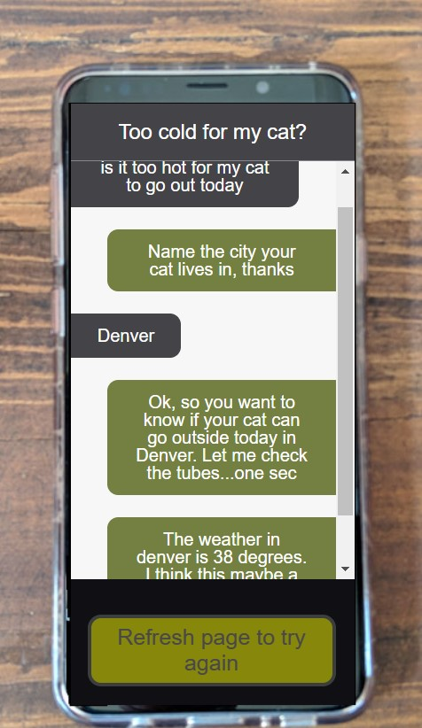

# AWS Fundamentals: Building Serverless Applications

This course is a part of Coursera's [AWS Fundamentals Specialization](https://www.coursera.org/specializations/aws-fundamentals).

This course consists of building a serverless application over the 7 exercises that integrates various AWS services such as:
- Amazon Lex
- Lambda
- API Gateway
- IAM
- CloudWatch
- DynamoDB

The pdf files consists of the steps to be followed to build a serverless application that answers to the question if the weather in any city is suitable enough to take your cat outside.

