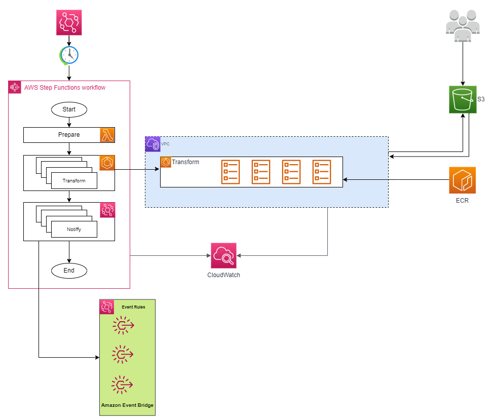

## Data-Pipeline-ECS

#### Architecture


#### Requirements
1. Docker setup locally
2. AWS CLI v2 and CDK v2 setup locally

#### Use the project
1.
```
cd task
./build.sh -i process-data -r <region-id>
```
2. 
```
cd cdk
cdk deploy
```