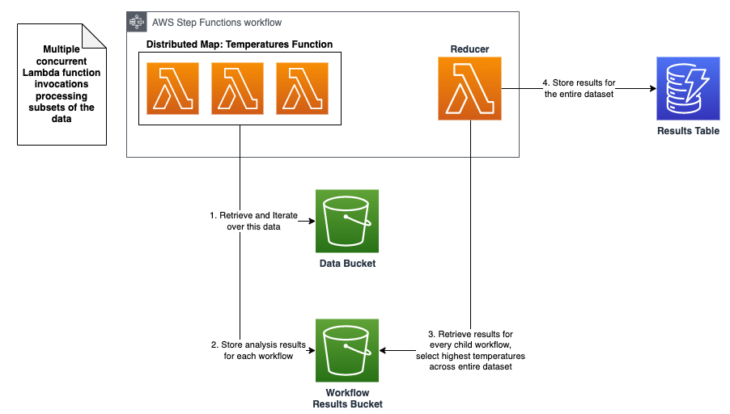

## Large-Scale-Data-Processing-Step-Functions-Distributed-Map

Aim:  Step Functions workflow uses a Map state in Distributed mode to process a list of S3 objects in an S3 bucket. Step Functions iterates over the list of objects and then launches thousands of parallel workflows, running concurrently, to process the items. The application code finds the weather station that has the highest average temperature on the planet each month.

Architecture:

Source Data: The dataset used in this module is a small subset of the 37+ GB of NOAA Global Surface Summary of Day. There are over 558,000 CSV files in the data set at over 37 GB. The average CSV file size is 66.5 KB. We'll look at a small subset of data for this workshop module.

References:
- https://aws.amazon.com/blogs/aws/step-functions-distributed-map-a-serverless-solution-for-large-scale-parallel-data-processing/
- https://serverlessland.com/content/service/step-functions/paved-path/distributed-data-processing-with-step-functions/introduction
- https://www.youtube.com/watch?v=iZ2aMAoUL24